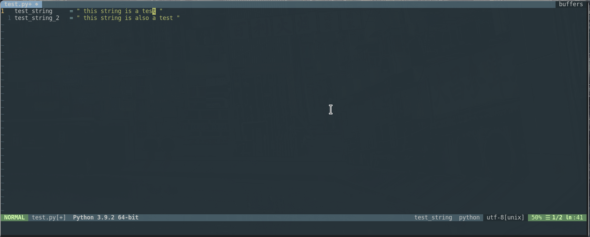

# F_String
A very simple vim plugin to assist with the conversion of normal python print strings into formatted print strings.

## Inspiration

Ever had a printed string in python just just wanted to quickly convert to a formatted string to display a value? Maybe for some debugging that's straightforward enough that it's not worth firing up your debugger? That happens to me a lot and I was tired of using more than two keystrokes to do it. As a result, I made some vim functions to do it for me. It's very simple, but it's helpful to me so maybe it will be helpful for you.

## Commands

**\<leader\>fs** - (mnemonic format-string) - adds an f to the begginning of the current string and jumps back to the place you were editing.

**\<leader\>fw** - (mnemonic format-word) - adds a colon in front of the current term then adds a bracket wrapped version in front of it ready for formatted printing.

